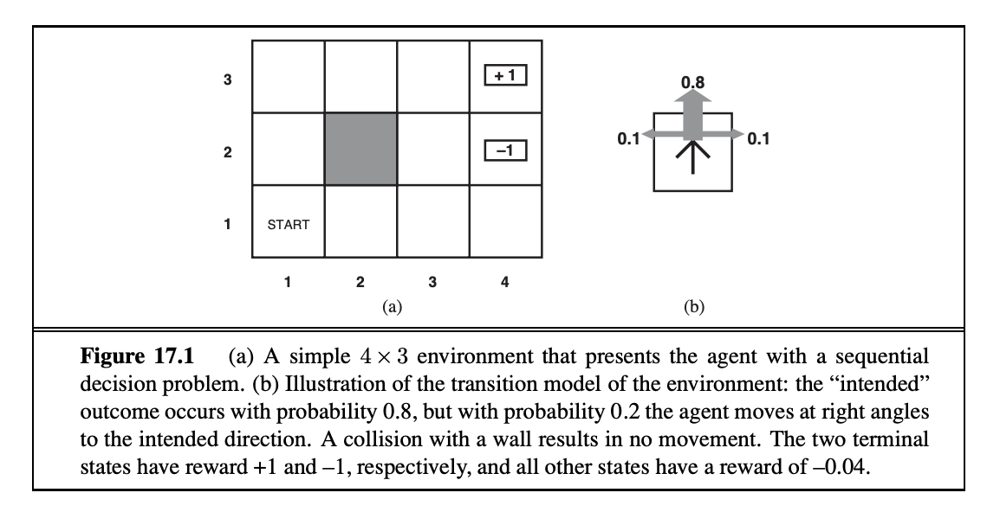

# MAI 5100 Homework 2: Reinforcement Learning

Welcome to homework 2, where you'll explore:
- Value Iteration
- Q-Learning
- Approximate Q-Learning
- Reinforcement Learning in Pacman

**Due:** **May 26, 2025** at **11:59 PM (Guyana time)**

## Table of Contents

- [Introduction](#introduction)
- [MDPs](#mdps)
- [Q1 (5 pts): Value Iteration](#q1-5-pts-value-iteration)
- [Q2 (5 pts): Policies](#q2-5-pts-policies)
- [Q3 (5 pts): Q-Learning](#q3-5-pts-q-learning)
- [Q4 (2 pts): Epsilon Greedy](#q4-2-pts-epsilon-greedy)
- [Q5 (1 pt): Q-Learning and Pacman](#q5-1-pt-q-learning-and-pacman)
- [Q6 (3 pts): Approximate Q-Learning](#q6-3-pts-approximate-q-learning)
- [Grading & Submission](#grading--submission)

## Introduction

In this project, you will implement value iteration and Q-learning. You will test your agents first on Gridworld (from class), then apply them to a simulated robot controller (Crawler) and Pacman.

As in previous projects, this project includes an autograder for you to grade your solutions on your machine. This can be run on all questions with the command:

```bash
python autograder.py
```

It can be run for one particular question, such as q2, by:

```bash
python autograder.py -q q2
```

It can be run for one particular test by commands of the form:

```bash
python autograder.py -t test_cases/q2/1-bridge-grid
```

The code for this project contains the following files:

**Files you'll edit:**
- `valueIterationAgents.py`: A value iteration agent for solving known MDPs.
- `qlearningAgents.py`: Q-learning agents for Gridworld, Crawler and Pacman.
- `analysis.py`: A file to put your answers to questions given in the project.

**Files you might want to look at:**
- `mdp.py`: Defines methods on general MDPs.
- `learningAgents.py`: Defines the base classes `ValueEstimationAgent` and `QLearningAgent`, which your agents will extend.
- `util.py`: Utilities, including `util.Counter`, which is particularly useful for Q-learners.
- `gridworld.py`: The Gridworld implementation.
- `featureExtractors.py`: Classes for extracting features on (state, action) pairs. Used for the approximate Q-learning agent.

**Supporting files you can ignore:**
- `environment.py`: Abstract class for general reinforcement learning environments. Used by `gridworld.py`.
- `graphicsGridworldDisplay.py`: Gridworld graphical display.
- `graphicsUtils.py`: Graphics utilities.
- `textGridworldDisplay.py`: Plug-in for the Gridworld text interface.
- `crawler.py`: The crawler code and test harness. You will run this but not edit it.
- `graphicsCrawlerDisplay.py`: GUI for the crawler robot.
- `autograder.py`: Project autograder
- `testParser.py`: Parses autograder test and solution files
- `testClasses.py`: General autograding test classes
- `test_cases/`: Directory containing the test cases for each question
- `reinforcementTestClasses.py`: Project 3 specific autograding test classes

**Files to Edit and Submit**: You will fill in portions of `valueIterationAgents.py`, `qlearningAgents.py`, and `analysis.py` during the assignment. Please do not change the other files in this distribution.

**Evaluation**: Your code will be autograded for technical correctness. Please do not change the names of any provided functions or classes within the code, or you will wreak havoc on the autograder. However, the correctness of your implementation – not the autograder's judgements – will be the final judge of your score.

## MDPs

To get started, run Gridworld in manual control mode, which uses the arrow keys:

```bash
python gridworld.py -m
```

You will see the two-exit layout from class. The blue dot is the agent. Note that when you press up, the agent only actually moves north 80% of the time. Such is the life of a Gridworld agent!

You can control many aspects of the simulation. A full list of options is available by running:

```bash
python gridworld.py -h
```

The default agent moves randomly

```bash
python gridworld.py -g MazeGrid
```

You should see the random agent bounce around the grid until it happens upon an exit. Not the finest hour for an AI agent.

Note: The Gridworld MDP is such that you first must enter a pre-terminal state (the double boxes shown in the GUI) and then take the special 'exit' action before the episode actually ends (in the true terminal state called `TERMINAL_STATE`, which is not shown in the GUI). If you run an episode manually, your total return may be less than you expected, due to the discount rate (`-d` to change; 0.9 by default).

Look at the console output that accompanies the graphical output (or use `-t` for all text). You will be told about each transition the agent experiences (to turn this off, use `-q`).

As in Pacman, positions are represented by `(x, y)` Cartesian coordinates and any arrays are indexed by `[x][y]`, with `'north'` being the direction of increasing `y`, etc. By default, most transitions will receive a reward of zero, though you can change this with the living reward option (`-r`).

## Q1 (5 pts): Value Iteration

Recall the value iteration state update equation:

%20%5Cleftarrow%20%5Cmax_a%20%5Csum_{s%27}%20T(s%2Ca%2Cs%27)%5Cleft%5BR(s%2Ca%2Cs%27)%20&plus;%20%5Cgamma%20V_k(s%27)%5Cright%5D)

Write a value iteration agent in `ValueIterationAgent`, which has been partially specified for you in `valueIterationAgents.py`. Your value iteration agent is an offline planner, not a reinforcement learning agent, and so the relevant training option is the number of iterations of value iteration it should run (option `-i`) in its initial planning phase. `ValueIterationAgent` takes an MDP on construction and runs value iteration for the specified number of iterations before the constructor returns.

Value iteration computes k-step estimates of the optimal values, V<sub>k</sub>. In addition to `runValueIteration`, implement the following methods for `ValueIterationAgent` using V<sub>k</sub>:

- `computeActionFromValues(state)` computes the best action according to the value function given by self.values.
- `computeQValueFromValues(state, action)` returns the Q-value of the (state, action) pair given by the value function given by `self.values`.

These quantities are all displayed in the GUI: values are numbers in squares, Q-values are numbers in square quarters, and policies are arrows out from each square.

Important: Use the "batch" version of value iteration where each vector V<sub>k</sub> is computed from a fixed vector V<sub>k−1</sub>, not the "online" version where one single weight vector is updated in place. This means that when a state's value is updated in iteration k based on the values of its successor states, the successor state values used in the value update computation should be those from iteration k−1 (even if some of the successor states had already been updated in iteration k).

*Note*: A policy synthesized from values of depth k (which reflect the next k rewards) will actually reflect the next k+1 rewards (i.e. you return π<sub>k+1</sub>). Similarly, the Q-values will also reflect one more reward than the values (i.e. you return Q<sub>k+1</sub>).

You should return the synthesized policy π<sub>k+1</sub>.

*Hint*: You may optionally use the `util.Counter` class in `util.py`, which is a dictionary with a default value of zero. However, be careful with `argMax`: the actual argmax you want may be a key not in the counter!

*Note*: Make sure to handle the case when a state has no available actions in an MDP (think about what this means for future rewards).

To test your implementation, run the autograder:

```bash
python autograder.py -q q1
```

The following command loads your `ValueIterationAgent`, which will compute a policy and execute it 10 times. Press a key to cycle through values, Q-values, and the simulation. You should find that the value of the start state (`V(start)`, which you can read off of the GUI) and the empirical resulting average reward (printed after the 10 rounds of execution finish) are quite close.

```bash
python gridworld.py -a value -i 100 -k 10
```

*Hint*: On the default `BookGrid`, running value iteration for 5 iterations should give you this output:

```bash
python gridworld.py -a value -i 5
```


*Grading*: Your value iteration agent will be graded on a new grid. I will check your values, Q-values, and policies after fixed numbers of iterations and at convergence (e.g. after 100 iterations).

## Q2 (5 pts): Policies

Consider the `DiscountGrid` layout, shown below. This grid has two terminal states with positive payoff (in the middle row), a close exit with payoff +1 and a distant exit with payoff +10. The bottom row of the grid consists of terminal states with negative payoff (shown in red); each state in this "cliff" region has payoff -10. The starting state is the yellow square. We distinguish between two types of paths: (1) paths that "risk the cliff" and travel near the bottom row of the grid; these paths are shorter but risk earning a large negative payoff, and are represented by the red arrow in the figure below. (2) paths that "avoid the cliff" and travel along the top edge of the grid. These paths are longer but are less likely to incur huge negative payoffs. These paths are represented by the green arrow in the figure below.


In this question, you will choose settings of the discount, noise, and living reward parameters for this MDP to produce optimal policies of several different types. **Your setting of the parameter values for each part should have the property that, if your agent followed its optimal policy without being subject to any noise, it would exhibit the given behavior.** If a particular behavior is not achieved for any setting of the parameters, assert that the policy is impossible by returning the string `'NOT POSSIBLE'`.

Here are the optimal policy types you should attempt to produce:

1. Prefer the close exit (+1), risking the cliff (-10)
2. Prefer the close exit (+1), but avoiding the cliff (-10)
3. Prefer the distant exit (+10), risking the cliff (-10)
4. Prefer the distant exit (+10), avoiding the cliff (-10)
5. Avoid both exits and the cliff (so an episode should never terminate)

To see what behavior a set of numbers ends up in, run the following command to see a GUI:

```bash
python gridworld.py -g DiscountGrid -a value --discount [YOUR_DISCOUNT] --noise [YOUR_NOISE] --livingReward [YOUR_LIVING_REWARD]
```

To check your answers, run the autograder:

```bash
python autograder.py -q q2
```

`question2a()` through `question2e()` should each return a 3-item tuple of `(discount, noise, living reward)` in `analysis.py`.

*Note*: You can check your policies in the GUI. For example, using a correct answer to 3(a), the arrow in (0,1) should point east, the arrow in (1,1) should also point east, and the arrow in (2,1) should point north.

*Note*: On some machines you may not see an arrow. In this case, press a button on the keyboard to switch to qValue display, and mentally calculate the policy by taking the arg max of the available qValues for each state.

*Grading*: I will check that the desired policy is returned in each case.

## Q3 (5 pts): Q-Learning

Note that your value iteration agent does not actually learn from experience. Rather, it ponders its MDP model to arrive at a complete policy before ever interacting with a real environment. When it does interact with the environment, it simply follows the precomputed policy (e.g. it becomes a reflex agent). This distinction may be subtle in a simulated environment like a Gridword, but it's very important in the real world, where the real MDP is not available.

You will now write a Q-learning agent, which does very little on construction, but instead learns by trial and error from interactions with the environment through its `update(state, action, nextState, reward)` method. A stub of a Q-learner is specified in `QLearningAgent` in `qlearningAgents.py`, and you can select it with the option `-a q`. For this question, you must implement the `update`, `computeValueFromQValues`, `getQValue`, and `computeActionFromQValues` methods.

*Note*: For `computeActionFromQValues`, you should break ties randomly for better behavior. The `random.choice()` function will help. In a particular state, actions that your agent hasn't seen before still have a Q-value, specifically a Q-value of zero, and if all of the actions that your agent has seen before have a negative Q-value, an unseen action may be optimal.

*Important*: Make sure that in your `computeValueFromQValues` and `computeActionFromQValues` functions, you only access Q values by calling `getQValue`. This abstraction will be useful for question 10 when you override `getQValue` to use features of state-action pairs rather than state-action pairs directly.

With the Q-learning update in place, you can watch your Q-learner learn under manual control, using the keyboard:

```bash
python gridworld.py -a q -k 5 -m
```

Recall that `-k` will control the number of episodes your agent gets to learn. Watch how the agent learns about the state it was just in, not the one it moves to, and "leaves learning in its wake." Hint: to help with debugging, you can turn off noise by using the `--noise 0.0` parameter (though this obviously makes Q-learning less interesting). If you manually steer Pacman north and then east along the optimal path for four episodes, you should see the following Q-values:


*Grading*: I will run your Q-learning agent and check that it learns the same Q-values and policy as our reference implementation when each is presented with the same set of examples. To grade your implementation, run the autograder:

```bash
python autograder.py -q q3
```

## Q4 (2 pts): Epsilon Greedy

Complete your Q-learning agent by implementing epsilon-greedy action selection in `getAction`, meaning it chooses random actions an epsilon fraction of the time, and follows its current best Q-values otherwise. Note that choosing a random action may result in choosing the best action - that is, you should not choose a random sub-optimal action, but rather any random legal action.

You can choose an element from a list uniformly at random by calling the `random.choice` function. You can simulate a binary variable with probability `p` of success by using `util.flipCoin(p)`, which returns `True` with probability `p` and `False` with probability `1-p`.

After implementing the `getAction` method, observe the following behavior of the agent in `GridWorld` (with epsilon = 0.3).

```bash
python gridworld.py -a q -k 100
```

Your final Q-values should resemble those of your value iteration agent, especially along well-traveled paths. However, your average returns will be lower than the Q-values predict because of the random actions and the initial learning phase.

You can also observe the following simulations for different epsilon values. Does that behavior of the agent match what you expect?

```bash
python gridworld.py -a q -k 100 --noise 0.0 -e 0.1
```

```bash
python gridworld.py -a q -k 100 --noise 0.0 -e 0.9
```

To test your implementation, run the autograder:

```bash
python autograder.py -q q4
```

With no additional code, you should now be able to run a Q-learning crawler robot:

```bash
python crawler.py
```

If this doesn't work, you've probably written some code too specific to the `GridWorld` problem and you should make it more general to all MDPs.

This will invoke the crawling robot from class using your Q-learner. Play around with the various learning parameters to see how they affect the agent's policies and actions. Note that the step delay is a parameter of the simulation, whereas the learning rate and epsilon are parameters of your learning algorithm, and the discount factor is a property of the environment.

## Q5 (1 pt): Q-Learning and Pacman

Time to play some Pacman! Pacman will play games in two phases. In the first phase, *training*, Pacman will begin to learn about the values of positions and actions. Because it takes a very long time to learn accurate Q-values even for tiny grids, Pacman's training games run in quiet mode by default, with no GUI (or console) display. Once Pacman's training is complete, he will enter *testing* mode. When testing, Pacman's `self.epsilon` and `self.alpha` will be set to 0.0, effectively stopping Q-learning and disabling exploration, in order to allow Pacman to exploit his learned policy. Test games are shown in the GUI by default. Without any code changes you should be able to run Q-learning Pacman for very tiny grids as follows:

```bash
python pacman.py -p PacmanQAgent -x 2000 -n 2010 -l smallGrid
```

Note that `PacmanQAgent` is already defined for you in terms of the `QLearningAgent` you've already written. `PacmanQAgent` is only different in that it has default learning parameters that are more effective for the Pacman problem (`epsilon=0.05, alpha=0.2, gamma=0.8`). You will receive full credit for this question if the command above works without exceptions and your agent wins at least 80% of the time. The autograder will run 100 test games after the 2000 training games.

*Hint*: If your `QLearningAgent` works for `gridworld.py` and `crawler.py` but does not seem to be learning a good policy for Pacman on `smallGrid`, it may be because your `getAction` and/or `computeActionFromQValues` methods do not in some cases properly consider unseen actions. In particular, because unseen actions have by definition a Q-value of zero, if all of the actions that have been seen have negative Q-values, an unseen action may be optimal. Beware of the `argMax` function from `util.Counter`!

To grade your answer, run:

```bash
python autograder.py -q q5
```

*Note*: If you want to experiment with learning parameters, you can use the option `-a`, for example `-a epsilon=0.1,alpha=0.3,gamma=0.7`. These values will then be accessible as `self.epsilon`, `self.gamma` and `self.alpha` inside the agent.

*Note*: While a total of 2010 games will be played, the first 2000 games will not be displayed because of the option `-x 2000`, which designates the first 2000 games for training (no output). Thus, you will only see Pacman play the last 10 of these games. The number of training games is also passed to your agent as the option `numTraining`.

*Note*: If you want to watch 10 training games to see what's going on, use the command:

```bash
python pacman.py -p PacmanQAgent -n 10 -l smallGrid -a numTraining=10
```

During training, you will see output every 100 games with statistics about how Pacman is faring. Epsilon is positive during training, so Pacman will play poorly even after having learned a good policy: this is because he occasionally makes a random exploratory move into a ghost. As a benchmark, it should take between 1000 and 1400 games before Pacman's rewards for a 100 episode segment becomes positive, reflecting that he's started winning more than losing. By the end of training, it should remain positive and be fairly high (between 100 and 350).

Make sure you understand what is happening here: the MDP state is the exact board configuration facing Pacman, with the now complex transitions describing an entire ply of change to that state. The intermediate game configurations in which Pacman has moved but the ghosts have not replied are not MDP states, but are bundled in to the transitions.

Once Pacman is done training, he should win very reliably in test games (at least 90% of the time), since now he is exploiting his learned policy.

However, you will find that training the same agent on the seemingly simple `mediumGrid` does not work well. In our implementation, Pacman's average training rewards remain negative throughout training. At test time, he plays badly, probably losing all of his test games. Training will also take a long time, despite its ineffectiveness.

Pacman fails to win on larger layouts because each board configuration is a separate state with separate Q-values. He has no way to generalize that running into a ghost is bad for all positions. Obviously, this approach will not scale.

## Q6 (3 pts): Approximate Q-Learning

Implement an approximate Q-learning agent that learns weights for features of states, where many states might share the same features. Write your implementation in `ApproximateQAgent` class in `qlearningAgents.py`, which is a subclass of `PacmanQAgent`.

*Note*: Approximate Q-learning assumes the existence of a feature function f(s,a) over state and action pairs, which yields a vector [f₁(s,a), …, fᵢ(s,a), …, fₙ(s,a)] of feature values. We provide feature functions for you in `featureExtractors.py`. Feature vectors are `util.Counter` (like a dictionary) objects containing the non-zero pairs of features and values; all omitted features have value zero. So, instead of an vector where the index in the vector defines which feature is which, we have the keys in the dictionary define the idenity of the feature.

The approximate Q-function takes the following form:

%3D%5Csum_%7Bi%3D1%7D%5En%20f_i(s%2Ca)%20w_i)

where each weight wᵢ is associated with a particular feature fᵢ(s,a). In your code, you should implement the weight vector as a dictionary mapping features (which the feature extractors will return) to weight values. You will update your weight vectors similarly to how you updated Q-values:

)

%20%5Cright)%20-%20Q(s%2Ca))

Note that the `difference` term is the same as in normal Q-learning, and r is the experienced reward.

By default, `ApproximateQAgent` uses the `IdentityExtractor`, which assigns a single feature to every `(state,action)` pair. With this feature extractor, your approximate Q-learning agent should work identically to `PacmanQAgent`. You can test this with the following command:

```bash
python pacman.py -p ApproximateQAgent -x 2000 -n 2010 -l smallGrid
```

*Important*: `ApproximateQAgent` is a subclass of `QLearningAgent`, and it therefore shares several methods like `getAction`. Make sure that your methods in `QLearningAgent` call `getQValue` instead of accessing Q-values directly, so that when you override `getQValue` in your approximate agent, the new approximate q-values are used to compute actions.

Once you're confident that your approximate learner works correctly with the identity features, run your approximate Q-learning agent with our custom feature extractor, which can learn to win with ease:

```bash
python pacman.py -p ApproximateQAgent -a extractor=SimpleExtractor -x 50 -n 60 -l mediumGrid
```

Even much larger layouts should be no problem for your `ApproximateQAgent` (*warning*: this may take a few minutes to train):

```bash
python pacman.py -p ApproximateQAgent -a extractor=SimpleExtractor -x 50 -n 60 -l mediumClassic
```

If you have no errors, your approximate Q-learning agent should win almost every time with these simple features, even with only 50 training games.

*Grading*: We will run your approximate Q-learning agent and check that it learns the same Q-values and feature weights as our reference implementation when each is presented with the same set of examples. To grade your implementation, run the autograder:

```bash
python autograder.py -q q6
```

## Part 2: Written Problem Solving



1. **R&N Problem 17.1: (8 points)**  
Consider the **4x3** world shown in Figure 17.1(a). There is an impassable wall/obstacle at state (2,2). The state **(4,3)** is a terminal state with a reward of **+1**, and state **(4,1)** is a terminal state with a reward of **-1**. All other states yield a reward of **-0.04** upon exiting them.

The transition model is stochastic, as illustrated in Figure 17.1(b):
* There is an 80% chance the agent moves in the intended direction.
* There is a 10% chance the agent moves 90 degrees left relative to the intended direction.
* There is a 10% chance the agent moves 90 degrees right relative to the intended direction.

If the agent attempts to move into an external boundary or the internal wall at (2,2), it remains in its current state.

a.  What are the optimal values ($V^*$) of the states at (1,1), (2,1), and (1,2)?

b.  What is the optimal policy ($\pi^*$) for the states at (1,1), (2,1), and (1,2)?

2. **R&N Problem 21.2: (8 points)**  
Consider the following 3 × 3 grid world:

```
+---+---+---+
| A |   | B |
+---+---+---+
|   | # |   |
+---+---+---+
|   |   |   |
+---+---+---+
```

A is the starting state and B is the terminal state with reward +5. The middle square contains a wall. The agent receives a reward of –0.04 in all other states. The discount factor γ is 0.9. The agent can choose from four actions: Up, Down, Left, and Right. When the agent bumps into a wall, it stays in the same state.

   a. What is the optimal value of each state (excluding B)?
   
   b. What is the optimal policy from each state?

3. **Manual Q-Learning: (10 points)**  
Consider a simple gridworld MDP with 4 states arranged in a 2 × 2 grid:

```
+---+---+
| s0 | s1 |
+---+---+
| s2 | s3 |
+---+---+
```

State s3 is a terminal state with reward +1. All other transitions have reward 0. From each non-terminal state, the agent can move in four directions: Up, Down, Left, Right. If the agent would move off the grid, it stays in the same state. The discount factor γ is 0.8 and the learning rate α is 0.5.

   a. All Q-values are initialized to 0. The agent performs the following experiences (state, action, reward, next state): (s0, Right, 0, s1), (s1, Down, 0, s3), (s3, NA, 1, Terminal), (s0, Down, 0, s2), (s2, Right, 0, s3), (s3, NA, 1, Terminal). Manually perform Q-learning updates for each of these experiences and show your calculations.
   
   b. After these updates, what action would an ε-greedy agent with ε = 0.2 choose in state s0? Show your work.
   
   c. What are the pros and cons of using a higher value of α (e.g., 0.9) versus a lower value (e.g., 0.1) in Q-learning?

4. **Feature-Based Q-Learning: (8 points)**  
Suppose you are implementing an approximate Q-learning agent for Pacman using the following features:
   - f₁(s,a) = 1 if action a moves Pacman closer to the nearest food, 0 otherwise
   - f₂(s,a) = 1 if action a moves Pacman away from the nearest ghost, 0 otherwise
   - f₃(s,a) = number of food pellets remaining in state s

   a. If the weights are w₁ = 2.0, w₂ = 3.0, and w₃ = -0.5, calculate Q(s,a) for a state where action a moves Pacman closer to food, away from a ghost, and there are 4 food pellets remaining.
   
   b. Suppose Pacman takes this action and arrives in a state s' where there are now 3 food pellets remaining. The reward for this transition is 1. Assuming γ = 0.9, calculate the temporal difference (TD) error for this transition.
   
   c. Using the TD error from part b and a learning rate α = 0.2, calculate the updated weights after this experience.
   
   d. What might be a better feature than simply counting the number of food pellets? Briefly explain why.

5. **Exploration-Exploitation: (6 points)**  
In ε-greedy Q-learning, we've discussed how the exploration rate ε affects learning.

   a. What problems might occur if ε is set too high? What if it's set too low?
   
   b. Many implementations decrease ε over time. Why is this a good strategy? How might you implement a schedule for decreasing ε?
   
   c. Besides ε-greedy, describe one other approach to balancing exploration and exploitation in reinforcement learning.

## Grading & Submission

For your final submission, you will create a pull request (PR) to the repository. Your PR should include:
1. A detailed description of the changes you made.
2. Answers to the following questions:
   - What challenges did you run into?
   - Which section was most fun and why?
   - How did you approach debugging your code?
   - What did you learn from this assignment?

### Steps to Submit Your Work

1. **Fork the Repository**: Create a fork of the course repository to your GitHub account.

2. **Create a Custom Named Folder**: Add your submission in a custom named folder in the `submissions` directory, e.g., `submissions/christopher_clarke`. This folder is where you will add your code and any other files related to the homework. **Do not make changes to the original files in the repository**.

3. **Commit Your Changes**: Ensure all your changes are committed with detailed messages.
   ```bash
   git add .
   git commit -m "Your detailed commit message here"
   ```

4. **Push Your Changes**: Push your changes to your forked repository.
   ```bash
   git push origin your-branch-name
   ```

5. **Create a Pull Request**: Go to your forked repository on GitHub and create a pull request to the main branch of the original repository. Include a detailed description and answer the interactive questions mentioned above.

6. **Submit the Written Portion**: Submit the written portion of the homework to Moodle or email it to christopher.clarke@uog.edu.gy.

7. **Review and Submit**: Once your PR is created, review it to ensure all changes are correctly documented. Submit the PR for review.

Remember, the focus is on your learning growth and understanding of the material, not just getting the right solution. Good luck!
