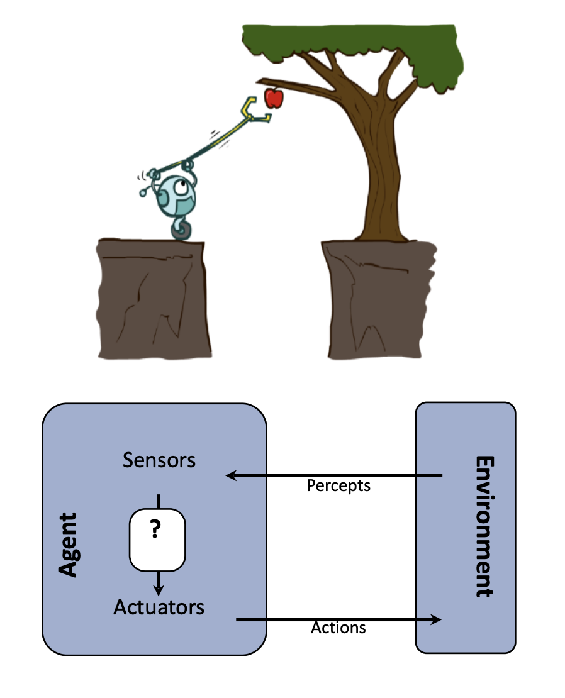

<!-- This week, we will cover the following topics:
1. Intelligent Agents
    - Agents and Environments
    - Good Behavior: The Concept of Rationality
    - The Nature of Environments
    - The Structure of Agents
2. Solving Problems by Searching
    - Problem-Solving Agents
    - Example Problems
    - Searching for Solutions
    - Uniformed Search Strategies
    - Informed Search Strategies
-->

# MAI 5100: Fundamentals of Artificial Intelligence

Instructor: Dr. Christopher Clarke

---

## Overview & Agenda (Part 1)

- Join the Slack Channel!
    - https://join.slack.com/t/uogmscai/shared_invite/zt-3118v5eqb-vpWNFUVtFYjKN_JUuAP~Ug

- Intelligent Agents
    - Agents and Environments
    - Good Behavior: The Concept of Rationality
    - The Nature of Environments
    - The Structure of Agents

---

## Overview & Agenda (Part 2)

- Solving Problems by Searching
    - Problem-Solving Agents
    - Searching for Solutions
    - Uniformed Search Strategies

- Homework 0 (Released on GitHub)
    - **Due Date: Saturday, 25-Mar-2025 11:59 PM**
    - https://github.com/ChrisIsKing/MAI5100/tree/main/hw/hw0

- Group Formation
    - **Due Date: Today** Email your group members to christopher.clarke@uog.edu.gy
---

## Intelligent Agents

- **Intelligent Agents** are systems that perceive their environment and take actions to achieve specific goals.
- They can be physical entities (like robots) or virtual entities (like software agents).
- Agents can be simple reflex agents, model-based reflex agents, goal-based agents, or utility-based agents.
- The design of an intelligent agent involves understanding the environment, the tasks it needs to perform, and the actions it can take.

---

## PEAS Principle

- **Performance Measure**: The criteria that determine how successful an agent is.
  - Example: For a self-driving car, the performance measure could include safety, speed, and passenger comfort.
- **Environment**: The external context in which the agent operates.
  - Example: For a self-driving car, the environment includes roads, traffic, pedestrians, and weather conditions.

---
## PEAS Principle (Cont'd)

- **Actuators**: The mechanisms through which the agent acts on the environment.
  - Example: For a self-driving car, actuators include the steering wheel, accelerator, and brakes.
- **Sensors**: The mechanisms through which the agent perceives the environment.
  - Example: For a self-driving car, sensors include cameras, LIDAR, and GPS.
---

## Good Behavior: The Concept of Rationality

- **Rationality**: An agent is rational if it acts to maximize its expected performance measure based on its knowledge.
- **Rational Agent**: An agent that selects actions that are expected to maximize its performance measure.

---

## Environments
- **Fully Observable vs. Partially Observable**: Whether the agent has complete information about the environment.
    - Example: A chess game is fully observable, while a poker game is partially observable.
- **Deterministic vs. Stochastic**: Whether the environment's state is determined by the agent's actions or involves randomness.
    - Example: A chess game is deterministic, while a weather prediction is stochastic.

---

## Environments (Cont'd)

- **Static vs. Dynamic**: Whether the environment changes while the agent is deliberating.
    - Example: A chess game is static, while a stock market is dynamic.
- **Discrete vs. Continuous**: Whether the environment has a finite number of states or an infinite number of states.
    - Example: A chess game has discrete states, while a robot navigating a room has continuous states.
- **Single-Agent vs. Multi-Agent**: Whether the environment involves multiple agents competing or cooperating.
    - Example: A chess game is single-agent, while a soccer game is multi-agent.

---
## Environments (Cont'd)

- **Episodic vs. Sequential**: Whether the agent's current decision only depends on the current percept or also on past actions.
    - Example: A chess game is sequential, while a spam filter is episodic.

---

## Task Environments

| Task | Fully / Partially | Deterministic / Stochastic | Static / Dynamic | Discrete / Continuous | Single / Multi | Episodic / Sequential |
|------|-------------------|----------------------------|------------------|-----------------------|----------------|-----------------------|
| Chess            |                   |                            |                  |                       |                |                       |
| Poker            |                   |                            |                  |                       |                |                       |
| Stock Market     |                   |                            |                  |                       |                |                       |
| Robot Nav        |                   |                            |                  |                       |                |                       |
| Email Filter     |                   |                            |                  |                       |                |                       |
| Weather          |                   |                            |                  |                       |                |                       |
| Soccer           |                   |                            |                  |                       |                |                       |
| Assembly Line    |                   |                            |                  |                       |                |                       |

---

## Task Environments (Filled)

| Task | Fully / Partially | Deterministic / Stochastic | Static / Dynamic | Discrete / Continuous | Single / Multi | Episodic / Sequential |
|------|-------------------|----------------------------|------------------|-----------------------|----------------|-----------------------|
| Chess            | Fully             | Deterministic              | Static           | Discrete              | Single         | Sequential            |
| Poker            | Partially         | Stochastic                 | Static           | Discrete              | Multi          | Sequential            |
| Stock Market     | Partially         | Stochastic                 | Dynamic          | Continuous            | Multi          | Sequential            |
| Robot Nav        | Partially         | Deterministic              | Dynamic          | Continuous            | Single         | Sequential            |
| Email Filter     | Partially         | Stochastic                 | Dynamic          | Discrete              | Single         | Episodic              |
| Weather          | Partially         | Stochastic                 | Dynamic          | Continuous            | Single         | Episodic              |
| Soccer           | Fully             | Stochastic                 | Dynamic          | Continuous            | Multi          | Sequential            |
| Assembly Line    | Fully             | Deterministic              | Static           | Discrete              | Single         | Sequential            |

---

## Types of Agents

- **Simple Reflex Agents**: Act based on current percepts and a set of condition-action rules.
    - Example: A thermostat that turns on the heater when the temperature drops below a certain threshold.
- **Model-Based Reflex Agents**: Maintain an internal state to keep track of the world and use it to make decisions.
    - Example: A robot that uses sensors to detect obstacles and adjust its path accordingly.

--- 

## Types of Agents (Cont'd)

- **Goal-Based Agents**: Use a goal to determine the best action to take.
    - Example: A navigation system that calculates the best route to a destination.
- **Utility-Based Agents**: Consider multiple goals and their relative importance to choose the best action.
    - Example: A self-driving car that prioritizes safety, speed, and comfort when making driving decisions.

---

## Types of Agents (Cont'd)

- **Learning Agents**: Improve their performance over time by learning from their experiences.
    - Example: A recommendation system that learns user preferences based on past interactions.
- **Multi-Agent Systems**: Involve multiple agents that can cooperate or compete to achieve their goals.
    - Example: A swarm of drones working together to map an area.

---

## Problem-Solving Agents

- When the correct action to take is not immediately obvious, an agent may need to to plan ahead: to consider a sequence of actions that form a path to a goal state. Such an agent is called a **problem-solving agent**, and the computational process it undertakes is called **search**.

- **Problem-Solving Agent**: An agent that can solve problems by searching through a space of possible actions and states.

---

## Problem-Solving Agents (Cont'd)

- **Problem**: A problem is defined by a **problem formulation**, which includes:
    - **Initial State**: The state of the world at the beginning of the problem.
    - **Actions**: The set of actions that can be taken to change the state of the world.
    - **Transition Model**: A description of how actions change the state of the world.
    - **Goal State**: The desired state of the world that the agent is trying to achieve.
    - **Path Cost**: A function that assigns a cost to each path from the initial state to the goal state.
    - **Solution**: A sequence of actions that leads from the initial state to the goal state.

---

## Adapted Slides from: CS 188: Introduction to Artificial Intelligence

---

## Homework 0: Search Algorithms

- **Due Date**: Saturday, 25-Mar-2025 11:59 PM (Guyana time)
- **Structure**:
  1. **Coding Portion**: Implement search algorithms in the PACMAN game.
  2. **Written Problem-Solving**: Analyze search algorithms.

- **Please** start your homework early to avoid last-minute issues. You **must** show your work.

---

### Coding Portion
- Implement and test the following search algorithms:
  - Depth-first search (DFS)
  - Breadth-first search (BFS)
  - Uniform-cost search (UCS)
  - A* search
  - Heuristics
  - Suboptimal search

---

### Written Problem-Solving
- Solve problems related to search algorithms and state spaces.

### Submission
- You **must** use Git for version control. We will be using your commits to track your progress.
- Create a pull request (PR) with your final submission.
- Submit the written portion to Moodle or email it to christopher.clarke@uog.edu.gy.

For more details, refer to the [README](https://github.com/ChrisIsKing/MAI5100/tree/main/hw/hw0).
